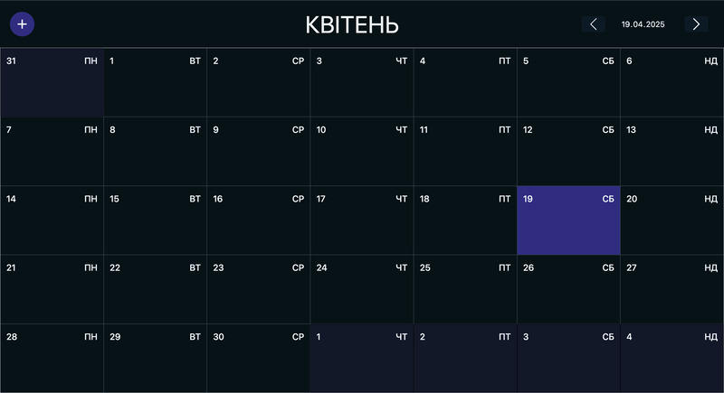
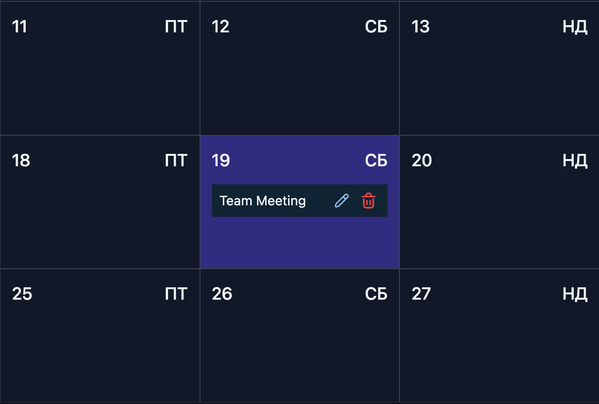
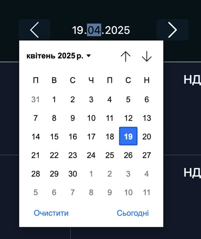
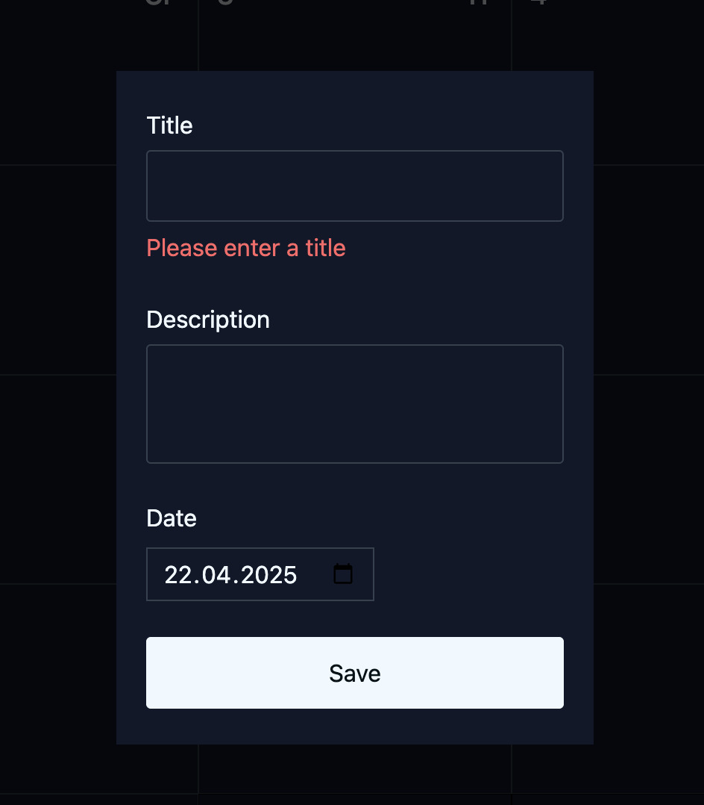
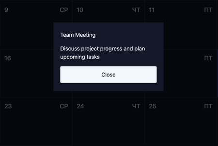
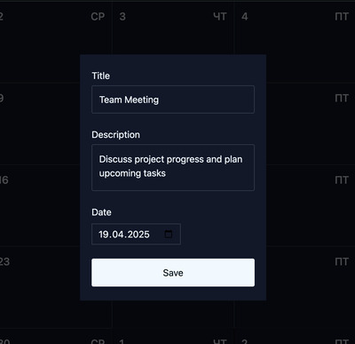

# Calendar

- Застосунок зберігає стан фільтрів після перезавантаження сторінки.
- Calendar використовує localStorage як сховище даних.
- Дає змогу зберігати, переглядати, редагувати та видаляти події.

Користувач заходить у застосунок і бачить сторінку, яка складається з:

- кнопки відкриття форми та створення події (лівий верхній кут);
- фільтру за датою. За замовчанням обрано поточний місяць;
- сітки календаря обраного у фільтрі місяця, яка складається з днів

Комірка поточного дня візуально виділена.

Комірка містить:

- номер дня місяця;
- день тижня;
- список подій.

Кожен запис має title, так кнопки редагування (icon edit) та виделення подій (icon delete)

Місяці перемикаються кнопками.

Кнопка календаря відкриває date picker, де є можливість обрати рік і місяць.

## Створення події

Створити подію можна кліком на кнопку створення події (лівий верхній кут), або кліком на комірку календаря. При кліку на комірку дня в календарі. Поле Date у заповнено автоматично.

Клік на створення події:

1. Відкривається незаповнена форма, яка складається з трьох полів:

- Title (required)
- Description
- Date
  
2. Форму можливо закрити кліком у будь-яку зону поза формою або Esc.
3. Кнопка Save зберігає та закриває форму.
4. Кнопка неактивна, доки обовʼязкові поля не будуть введені.

## Перегляд подій:

- Клік на title події відкриває модальне вікно з деталями події

## Редагування подій:

- Клік на іконку редагування відкриває заповнену форму в режимі редагування.
- Кнопка Save оновлює подію та закриває форму.

## Видалення подій:

- Клік на іконку видалення видаляє подію з календаря.